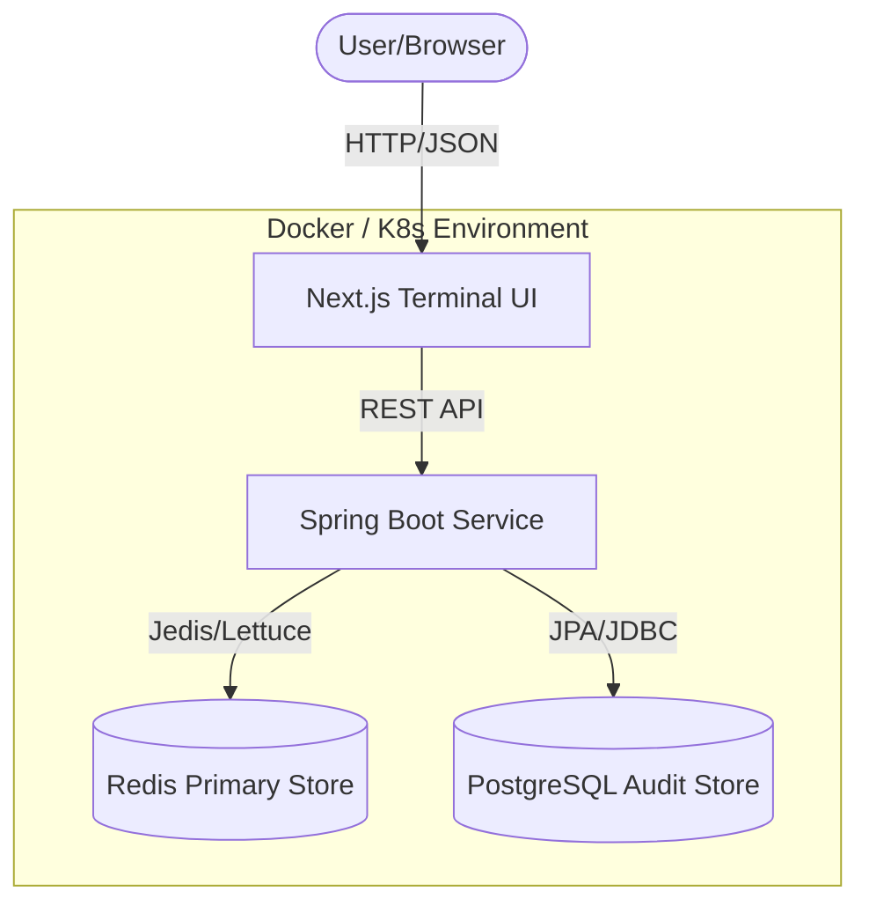

# 🚀 TermiStack

[](https://opensource.org/licenses/MIT)
[](https://spring.io/projects/spring-boot)
[](https://nextjs.org/)
[](https://redis.io/)
[](https://www.docker.com/)

TermiStack is a high-performance, full-stack user management solution featuring a Spring Boot backend, Redis persistence, PostgreSQL audit storage, and a unique Next.js terminal-themed testing interface.

---

## 🏗️ Architecture



---

## 📖 Overview

This project provides a robust foundation for building and testing RESTful services. It consists of a containerized Java backend and a modern React-based terminal emulator that makes API testing feel like a native CLI experience.

Whether you're managing users or testing complex JSON payloads, this tool provides the speed of Redis and the flexibility of a terminal-driven UI.

---

## ✨ Features

- **Full CRUD API**: Create, Read, Update, and Delete users with high-performance Redis storage.
- **Audit Trail**: User create, update, and delete events are stored in PostgreSQL.
- **Terminal Emulator UI**: A "Matrix-style" command-line interface built with Next.js for all your testing needs.
- **Command History**: Navigate previous requests effortlessly using **Up/Down Arrow keys**.
- **Smart Pathing**: Auto-prefixes IDs for deletions and updates—no more typing long URLs.
- **Health Monitoring**: Integrated `/health` endpoint with a dedicated terminal command.
- **Multi-Environment Ready**: Full support for Docker Compose and Kubernetes deployments.
- **Automated Verification**: Built-in bash smoke tests for rapid CI/CD validation.

---

## 🛠️ Tech Stack

| Layer              | Technologies                                          |
| :----------------- | :---------------------------------------------------- |
| **Backend**        | Java 17, Spring Boot 3.2.5, Spring Data Redis, Spring Data JPA, Lombok |
| **Frontend**       | Next.js 14, TypeScript, Tailwind CSS, Fira Code       |
| **Database**       | Redis primary store, PostgreSQL audit store           |
| **Infrastructure** | Docker, Docker Compose, Kubernetes (K8s)              |
| **Testing**        | Bash, Curl                                            |

---

## 📦 Installation

### Prerequisites

- **Docker & Docker Compose** (Recommended)
- **Java 17** & **Maven** (For local development)
- **Node.js 20+** (For frontend development)

### One-Command Setup

The easiest way to get started is using Docker Compose:

```bash
docker compose up --build -d
```

---

## ▶️ Usage / Running the Project

### Accessing the Application

- **Terminal UI**: [http://localhost:3000](http://localhost:3000)
- **Backend API**: [http://localhost:8080/users](http://localhost:8080/users)

### Terminal UI Commands

Once in the terminal UI, you can run:

- `help` - View all available commands.
- `get /users` - List all users.
- `post /users {"name": "Alice", "email": "alice@dev.com"}` - Create a user.
- `delete <id>` - Remove a user by ID.
- `audits` - List PostgreSQL audit events.
- `health` - Check API status.
- `clear` - Reset terminal screen.

---

## 🧪 Testing

### Automated Smoke Test

Run the comprehensive bash test suite to verify all endpoints:

```bash
chmod +x smoke-test.sh
./smoke-test.sh
```

---

## 📡 API Documentation

### Endpoints

| Method   | Endpoint      | Description          |
| :------- | :------------ | :------------------- |
| `GET`    | `/health`     | Check system status  |
| `GET`    | `/audits`     | Fetch user audit events |
| `GET`    | `/users`      | Fetch all users      |
| `GET`    | `/users/{id}` | Fetch user by ID     |
| `POST`   | `/users`      | Create a new user    |
| `PUT`    | `/users/{id}` | Update existing user |
| `DELETE` | `/users/{id}` | Remove a user        |

---

## 🏗️ Project Structure

```bash
.
├── backend/          # Spring Boot Application
│   ├── src/          # Java source code
│   ├── pom.xml       # Maven dependencies
│   └── Dockerfile    # Backend container spec
├── frontend/         # Next.js Application
│   ├── src/          # React components & logic
│   └── Dockerfile    # Frontend container spec
├── k8s/              # Kubernetes manifests
├── smoke-test.sh     # Automation test script
└── docker-compose.yml # Orchestration file
```

---

## 🚀 Deployment

### Kubernetes

Deploy the entire stack to your cluster:

```bash
kubectl apply -f k8s/redis.yaml
kubectl apply -f k8s/postgres.yaml
kubectl apply -f k8s/backend.yaml
kubectl apply -f k8s/frontend.yaml
```

---

## 📚 Documentation

For more detailed information, please refer to the documentation in the [docs/](./docs) folder:

- [🏗️ System Architecture](./docs/architecture.md)
- [📡 API Specification](./docs/api-spec.md)

---

## 🤝 Contributing

1. Fork the Project
2. Create your Feature Branch (`git checkout -b feature/AmazingFeature`)
3. Commit your Changes (`git commit -m 'Add some AmazingFeature'`)
4. Push to the Branch (`git push origin feature/AmazingFeature`)
5. Open a Pull Request

---

## 📄 License

Distributed under the MIT License. See `LICENSE` for more information.

---

## 👤 Author

**Cloud Devops Engineer** - [Amul Thantharate](https://www.linkedin.com/in/amul-thantharate/) | [GitHub](https://github.com/AmulThantharate)

---

## ⭐ Support

If you like this project, please give it a ⭐ on GitHub!
